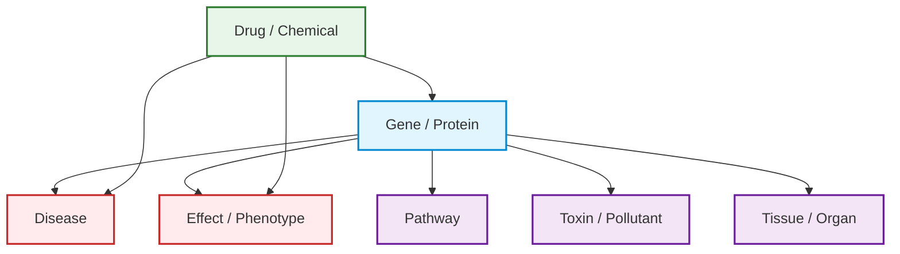

# AI Tools Reference

AIVA has access to a suite of specialized tools that it invokes automatically based on your questions. You do not need to specify which tool to use. AIVA selects the appropriate tool (or combination of tools) based on the context of your query.

---

## Genomic Data Query

The Genomic Data Query tool allows AIVA to query your uploaded variant data directly using SQL. AIVA translates your natural language questions into SQL queries, executes them against your data, and returns the results.

**Capabilities**:

- Query any column in your uploaded samples, including VCF fields, INFO subfields, and annotation columns.
- Aggregate data with counts, averages, grouping, and statistical summaries.
- Filter and sort results based on any combination of criteria.
- Access-controlled per user: AIVA can only query data belonging to the current user's samples.
- Read-only: AIVA cannot modify or delete your data.

**Example prompts**:

| Goal | Prompt |
|------|--------|
| Count variants | "How many variants are in my sample?" |
| Filter by gene and frequency | "Show me all missense variants on chromosome 17 with gnomAD allele frequency below 0.01." |
| Rank genes | "What are the top 10 genes based on the @samples:sample1 phenotype?" |
| Interpretation | "Identify the most pathogenic variants in my sample." |
| Cross-sample comparison | "Compare the variant counts between @samples:sample1, @samples:sample2." |
| Shared variants | "Are there any variants shared between samples in @samples:multisample?" |

### How queries work

1. **You ask a question** in natural language.
2. **AIVA generates a SQL query** based on your question and the schema of your uploaded sample.
3. **The query executes** against the database where your parsed data is stored.
4. **Results are returned** as a formatted table, summary, or chart, depending on what best fits the answer.

!!! info "Schema awareness"
    AIVA knows the column names and data types of your uploaded samples. When you ask about "pathogenic variants" or "allele frequency," it maps your natural language terms to the correct database columns. For samples with Small Variant Annotation applied, this includes all annotation fields such as `Consequence`, `SYMBOL`, `SIFT`, etc.

---

## Variant Annotation

The Variant Annotation tool performs real-time lookups for individual variants against multiple curated genomic databases. Unlike batch annotation during upload (Small Variant Annotation), this tool is used interactively during a conversation to retrieve detailed information about specific variants on demand.

### Query formats

You can query variants using several identifier formats:

- **Gene and HGVS notation**: `BRCA1 c.5266dupC`
- **Genomic coordinates**: `chr17:41245466 G>A`
- **rsID**: `rs80357906`
- **Gene name** (for general information): `TP53`

**Example prompts**:

| Goal | Prompt |
|------|--------|
| Clinical significance | "What is the ClinVar classification for BRCA1 c.5266dupC?" |
| Population frequency | "Look up the gnomAD allele frequency for chr17:41245466 G>A." |
| Deleteriousness scores | "Get CADD, SIFT, and PolyPhen scores for chr7:117559590 T>G." |
| Comprehensive lookup | "Give me the full annotation for rs80357906 including ClinVar, gnomAD, and in silico predictions." |
| Multiple variants | "Look up ClinVar classifications for BRCA1 c.68_69delAG and BRCA2 c.5946delT." |

!!! warning "In silico predictions are supportive evidence only"
    Computational predictions should not be used as the sole basis for clinical classification. Always consider them alongside clinical data, population frequencies, and functional studies per [ACMG/AMP guidelines](../analysis/acmg-classification.md).

### Batch vs. real-time annotation

| Feature | Variant Annotation Tool (Chat) | Small Variant Annotation (Upload) |
|---------|-------------------------------|------------------------|
| **Scope** | Individual variants, on demand | Entire VCF file |
| **Speed** | Seconds per variant | Minutes to hours for large files |
| **Use case** | Focused investigation of specific variants | Comprehensive annotation of all variants in a sample |

For batch annotation, enable annotation during [VCF Upload](../samples/vcf-upload.md#annotation-options-vcf-only).

---

## Web Search

The Web Search tool searches the internet and extracts content from web pages in real time. It retrieves up-to-date information that may not be present in your uploaded data or in AIVA's built-in knowledge bases.

**Capabilities**:

- **Full-text web search**: Search the open web for any topic and receive summarized results.
- **Page scraping**: Extract and parse the content of specific URLs, including tables and structured data.
- **Content summarization**: AIVA reads retrieved content and distills it into a focused answer.
- **Source attribution**: Results include the URLs of the pages consulted, so you can verify the information.

**Example prompts**:

| Goal | Prompt |
|------|--------|
| Clinical guidelines | "What does the latest ACMG guidance say about classifying VUS?" |
| Treatment protocols | "Find the most recent NCCN guidelines for hereditary breast cancer." |
| Regulatory updates | "Has the FDA approved any new therapies for EGFR-mutated NSCLC in the last year?" |

Web Search is best for general web content, guidelines hosted on organization websites, and non-PubMed sources. For structured PubMed literature searches, use the [Biomedical Literature](#biomedical-literature) tool instead.

---

## Biomedical Literature

The Biomedical Literature tool searches NCBI's biomedical literature database, a resource that provides entity-annotated access to PubMed articles. Use it to find publications related to specific genes, diseases, chemicals, mutations, or species.

**Capabilities**:

- **Entity-based search**: Search by gene name, disease, chemical, or specific mutation with entity recognition.
- **Article retrieval**: Return PubMed article titles, abstracts, and publication metadata (authors, journal, year).
- **Entity co-occurrence**: Find articles that mention two or more entities together (e.g., a gene AND a disease).
- **Annotated results**: Returned abstracts include highlighted biomedical entities for quick scanning.

**Example prompts**:

| Goal | Prompt |
|------|--------|
| Gene-disease literature | "Find recent publications about BRCA2 and ovarian cancer." |
| Drug-mechanism research | "What has been published about olaparib in relation to homologous recombination deficiency?" |
| Mutation-specific papers | "Search for papers mentioning the BRAF V600E mutation in melanoma." |
| Gene function review | "Find review articles about the function of PTEN in cancer." |
| Co-occurring entities | "Find papers that mention both TP53 and MDM2." |

!!! tip "Access full articles"
    Use the PMID to look up the full article on PubMed: `pubmed.ncbi.nlm.nih.gov/PMID`. Many articles are available in full text through PubMed Central.

### Biomedical Literature vs. Web Search

| Feature | Biomedical Literature | Web Search |
|---------|----------------------|------------|
| **Source** | PubMed-indexed literature | Entire web |
| **Entity recognition** | Yes (genes, diseases, chemicals, mutations) | No |
| **Structured metadata** | Yes (PMID, authors, journal) | Limited |
| **Content type** | Peer-reviewed biomedical literature | Any web content |
| **Best for** | Finding published evidence for variant interpretation | Finding guidelines, news, non-journal sources |

---

## Code Interpreter

The Code Interpreter gives AIVA access to a sandboxed Python execution environment equipped with scientific computing libraries. It enables statistical analysis, custom calculations, and publication-quality visualizations directly within the chat.

### Capabilities

- **Statistical analysis**: t-tests, chi-squared, Fisher's exact, Mann-Whitney U, correlation analysis, regression.
- **Data visualization**: Histograms, bar charts, scatter plots, box plots, heatmaps, pie charts.
- **Custom calculations**: Derive new metrics, apply custom filtering logic, transform and reshape data.

**Example prompts**:

| Goal | Prompt |
|------|--------|
| Distribution plot | "Plot the allele frequency distribution for all variants in my sample." |
| Statistical test | "Run a Fisher's exact test comparing pathogenic variants on chromosome 13 vs. chromosome 17." |
| Bar chart | "Create a bar chart showing the top 20 genes by variant count." |
| Correlation | "Is there a correlation between CADD score and gnomAD allele frequency in my data?" |
| Summary statistics | "Calculate summary statistics for the quality scores in my sample." |
| Custom analysis | "For each gene with more than 5 variants, calculate the ratio of missense to synonymous variants." |

!!! info "Plots appear inline"
    Matplotlib charts are rendered as images directly in the conversation. You can view them at full resolution and download them without leaving the chat.

!!! note "Data access"
    The Code Interpreter does not have direct access to your database. To analyze your uploaded data with Python, AIVA first queries the data using the Genomic Data Query tool, then passes the results to the Code Interpreter. This happens automatically.

### Tips for best results

- **Be specific about the visualization type**: "Create a histogram" or "Make a scatter plot" helps AIVA choose the right chart.
- **Specify axes and labels**: "Plot allele frequency on the x-axis and CADD score on the y-axis" produces clearer charts.
- **Request statistical details**: "Include the p-value and confidence interval" ensures the output includes the numbers you need.

---

## Knowledge Graph

The Knowledge Graph tool queries a curated network of gene-protein-drug interactions. It enables pathway exploration, drug-target discovery, and protein interaction analysis directly within AIVA Chat.

### What is in the Knowledge Graph?

### Capabilities

- **Drug-target lookups**: Find which drugs target a specific gene or protein.
- **Protein interaction networks**: Explore which proteins interact with a protein of interest.
- **Pathway analysis**: Identify which biological pathways a gene or protein participates in.
- **Network traversal**: Trace multi-hop relationships (e.g., from a gene to its protein product to interacting proteins to drugs targeting those proteins).
- **Drug repurposing candidates**: Identify approved drugs that target proteins in the same pathway as your gene of interest.

**Example prompts**:

| Goal | Prompt |
|------|--------|
| Drug targets | "What drugs target the EGFR protein?" |
| Compound queries | "Which proteins interact with BRCA1 and are targetable by approved drugs?" |
| Pathway tracing | "Trace the pathway from KRAS to downstream effectors." |
| Drug repurposing | "Are there any approved drugs that target proteins in the MAPK signaling pathway?" |
| Gene-drug relationships | "What is the relationship between the ALK gene and crizotinib?" |

!!! note "Graph scope"
    The knowledge graph is curated from established databases and may not include every known interaction. AIVA automatically combines Knowledge Graph queries with [Web Search](#web-search) or [Biomedical Literature](#biomedical-literature) lookups.

---

## Clinical Trials

The Clinical Trials tool searches ClinicalTrials.gov directly from AIVA Chat. Use it to find trials relevant to specific genes, variants, conditions, or interventions.

**Capabilities**:

- Search by condition, disease, gene, intervention, or drug name.
- Filter by trial status (recruiting, active, completed) and phase (Phase 1, 2, 3, 4).
- Retrieve trial titles, NCT numbers, sponsors, phases, enrollment status, and eligibility summaries.

**Example prompts**:

| Goal | Prompt |
|------|--------|
| Gene-specific trials | "Are there any active clinical trials for TP53-mutated breast cancer?" |
| Drug-specific trials | "Find recruiting trials for olaparib in ovarian cancer." |
| Phase filtering | "What phase 3 trials are studying PARP inhibitors?" |
| Rare disease | "Are there any clinical trials for patients with PALB2 mutations?" |
| Combination therapy | "Find trials combining immunotherapy with targeted therapy for BRAF-mutated melanoma." |
| Eligibility | "What are the eligibility criteria for NCT04171700?" |

!!! tip "Use NCT numbers for follow-up"
    If you find a trial of interest, you can ask AIVA for more details using its NCT number, or visit `clinicaltrials.gov/study/NCTxxxxxxxx` directly.

### Limitations

- Results are sourced from ClinicalTrials.gov and may not include trials registered only on other registries (e.g., EU Clinical Trials Register, ANZCTR).
- Trial information reflects what is publicly registered. Enrollment status may not always be current.

!!! warning "Not a substitute for clinical judgment"
    Clinical trial results from AIVA are informational. Decisions about patient enrollment should involve the treating physician and the trial's principal investigator.

---

## Phenotype-Gene Prioritization

The Phenotype-Gene Prioritization tool maps clinical phenotype descriptions to ranked candidate genes. By inputting Human Phenotype Ontology (HPO) terms or plain-language phenotype descriptions, you receive a prioritized list of genes most likely associated with the observed phenotypes, a powerful aid for rare disease diagnosis and gene panel prioritization.

### How it works

This tool uses a knowledge base of gene-phenotype associations derived from HPO, OMIM, and other curated resources to rank genes by their relevance to a set of input phenotypes.

- **Input**: One or more HPO terms or clinical phenotype descriptions. You can also provide **negative phenotype terms** (phenotypes the patient does not have) to further refine the ranking.
- **Output**: A ranked list of candidate genes with scores indicating the strength of association.
- **Speed**: Results are returned in seconds.

!!! tip "More phenotypes improve specificity"
    Providing multiple phenotype terms narrows the candidate gene list and increases the accuracy of the ranking. A single broad phenotype (e.g., "seizures") returns many candidates, while combining it with additional phenotypes produces a more focused result.

### Limitations

- This tool relies on known gene-phenotype associations. Novel or poorly characterized relationships may not be represented.
- Results are probabilistic rankings, not diagnostic conclusions.

!!! warning "Clinical interpretation required"
    Phenotype-Gene Prioritization results are intended to assist in gene prioritization. They do not constitute a diagnosis. All candidate genes should be evaluated in the context of the patient's full clinical picture by a qualified professional.

---

## Variant Classification

The Variant Classification tool uses an AI agent to classify genomic variants using ACMG/AMP or AMP/ASCO/CAP guidelines directly within AIVA Chat. Unlike traditional rule-based classifiers, AIVA is **phenotype-aware**: it integrates the patient's clinical phenotype, inheritance pattern, and disease context into variant interpretation, performing extensive real-time literature review of genes in phenotype context.

In [benchmarks against 8,387 clinically classified variants](https://mamidihealth.substack.com/p/benchmarking-aiva-how-phenotype-aware) from ClinGen's Evidence Repository across 11 disease categories, AIVA achieved an **F1 score of 80.5%**, outperforming InterVar (60.6%) and BIAS-2015 (75.3%), and leading in 9 of 11 disease categories.

**Capabilities**:

- Classify variants according to ACMG/AMP guidelines for germline variants.
- Classify variants according to AMP/ASCO/CAP guidelines for somatic variants.
- Incorporate patient phenotype and clinical context to improve classification accuracy.
- Return the applied criteria with supporting evidence for each classification.

**Example prompt**:

> "Classify this variant in the context of a patient with hereditary breast cancer: BRCA2 c.5946delT."

---

## Task Manager

The Task Manager is an always-on internal tool that helps AIVA stay focused on your request. It breaks complex queries into discrete steps and tracks progress through multi-step analysis workflows. This tool cannot be disabled.

**Capabilities**:

- Automatically decompose complex requests into trackable sub-tasks.
- Track progress through multi-step analysis workflows.
- Keep AIVA focused and organized when chaining multiple tools.

---

## Enabling and disabling tools

You can control which tools AIVA has access to for a given conversation:

1. Open the tool configuration panel from the chat input area.
2. Toggle individual tools on or off.
3. Click **Apply** to save your selection.

AIVA will only use the enabled tools when responding to your queries.

This is useful when you want to:

- **Restrict to local data only**: Disable Web Search, Biomedical Literature, and Clinical Trials to keep AIVA focused on your uploaded data.
- **Reduce latency**: Fewer available tools means AIVA spends less time evaluating which tool to use.
- **Focus analysis**: Enable only the specific tools relevant to your current task.

