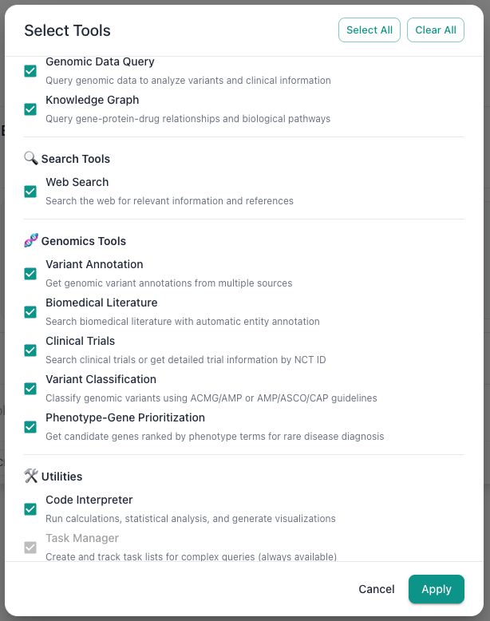
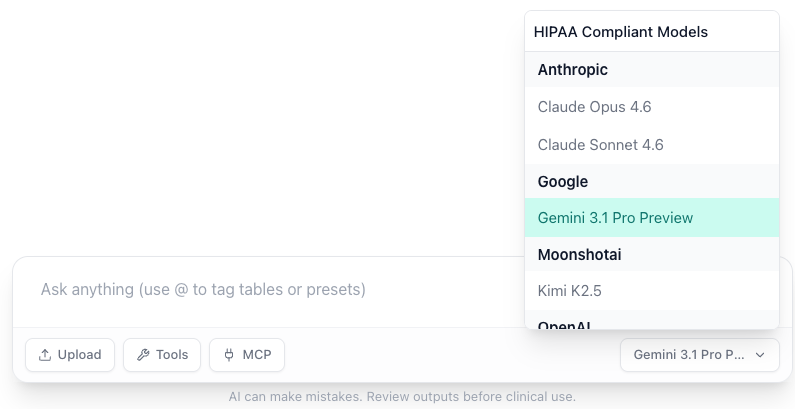

# AIVA Chat

AIVA (AI-assisted Variant Analysis) is our AI Clinical Analyst agent, purpose-built for clinical variant analysis and interpretation. Instead of manually applying filters and reviewing variants, you can ask AIVA questions in plain English and receive answers backed by your actual sample data, published literature, and curated knowledge bases.

---

## What Can AIVA Do?

AIVA is more than a chatbot. It has access to a suite of specialized tools that it invokes automatically based on your questions:

| Tool | What It Does |
|------|-------------|
| **Genomic Data Query** | Queries your uploaded variant data directly. Ask about specific genes, filter by allele frequency, count variants by consequence, all in natural language. |
| **Web Search** | Searches the web and scrapes pages for up-to-date information on genes, diseases, therapies, and guidelines. |
| **Variant Annotation** | Performs real-time lookups against ClinVar, gnomAD, SIFT, and other annotation databases for individual variants. |
| **Biomedical Literature** | Searches biomedical literature by gene, disease, chemical, or mutation to find relevant publications. |
| **Code Interpreter** | Executes Python code with pandas, numpy, scipy, and matplotlib for statistical analysis and custom visualizations. |
| **AIVA-KG** | Our internal knowledge graph (gene-disease-phenotype-drug-pathway) to explore biological relationships. |
| **Clinical Trials** | Searches ClinicalTrials.gov for active and completed trials related to genes, diseases, or drugs. |
| **Variant Classification** | Classifies genomic variants using ACMG/AMP or AMP/ASCO/CAP guidelines with structured evidence. |
| **Phenotype-Gene Prioritization** | Performs phenotype-to-gene prioritization to identify candidate genes from clinical phenotype descriptions. |
| **MCP Integration** | Connects to user-configured external tools via the Model Context Protocol for custom workflows. See [MCP Integration](mcp/index.md). |
| **Task Manager** | Tracks tasks and action items within your conversation for workflow management. |

For detailed documentation on each tool, see [AI Tools](ai-tools.md).

---

## In This Section

### AI Tools Reference

Full documentation for all tools available to AIVA, including capabilities, example prompts, and output formats.

[:octicons-arrow-right-24: AI Tools](ai-tools.md)

---

## How It Works

AIVA streams responses in real time, which means:

- **Responses stream in real time**: You see the answer as it is generated, word by word, rather than waiting for the entire response.
- **Tool calls are transparent**: When AIVA invokes a tool (e.g., querying your database), you see the tool name and a summary of what it did, so you can verify the approach.
- **Results are richly formatted**: Tool outputs are rendered as interactive tables, charts, JSON, or formatted markdown depending on the data type.

### Tool Selection

You do not need to tell AIVA which tool to use. Based on your question, it automatically selects the appropriate tool or combination of tools. For example:

- "How many pathogenic variants are in my sample?": AIVA uses the **Genomic Data Query** tool to query your data.
- "What does the latest literature say about BRCA1?": AIVA uses **Biomedical Literature** and/or **Web Search**.
- "Plot the allele frequency distribution": AIVA uses the **Code Interpreter** to generate a matplotlib chart.
- "Are there any clinical trials for TP53 mutations in breast cancer?": AIVA uses the **Clinical Trials** tool.

### Enabling and Disabling Tools

You can control which tools AIVA has access to. Open the tool configuration panel in the chat interface to enable or disable individual tools. This is useful when you want to:

- Restrict AIVA to only query your local data (disable web search, literature tools).
- Focus on a specific tool for targeted analysis.
- Reduce response latency by limiting the tool set.

### Model Selection

AIVA offers a choice of language models for AIVA. Different models offer different tradeoffs between speed, cost, and reasoning capability. See [Model Selection](model-selection.md) for details.

---

## Quick Start

1. Navigate to the **Chat** tab in the header navigation bar.
2. Click **New Conversation** in the sidebar or start typing in the message input.
3. Type a question about your data, a gene, a disease, or any genomic topic.
4. Press ++enter++ or click the send button.
5. Watch as AIVA streams its response, invoking tools as needed.

!!! tip "Be specific"
    The more specific your question, the better the answer. Instead of "Tell me about my data," try "What are the top 10 most frequently mutated genes in my sample, and how many of those variants are classified as pathogenic in ClinVar?"
