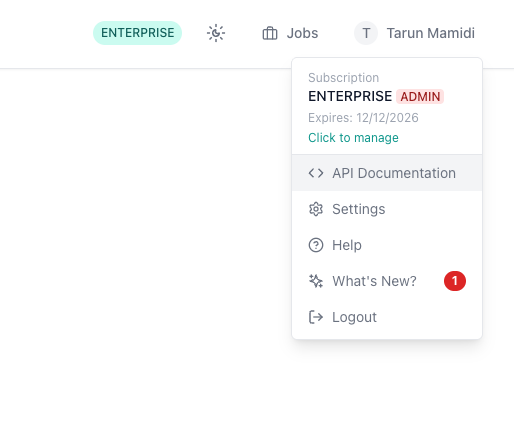
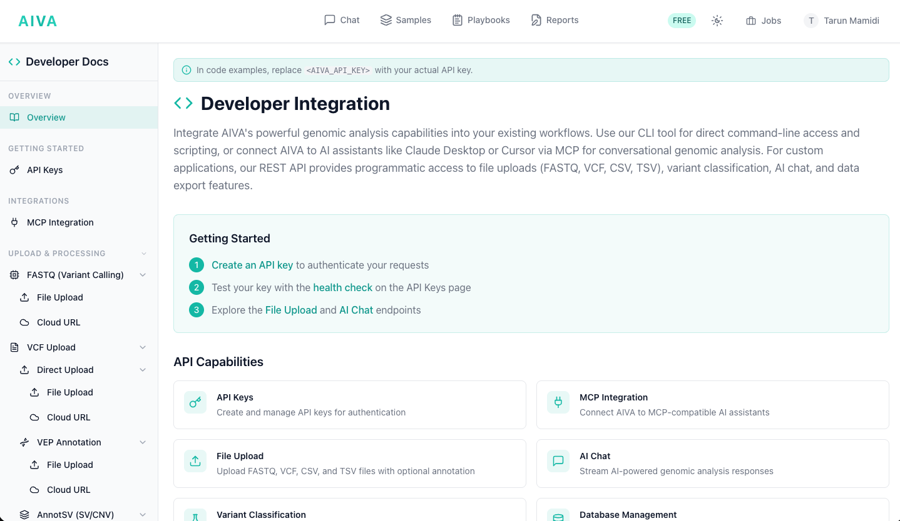

# API Reference

The AIVA API provides programmatic access to the platform's core features, including file uploads, variant calling pipelines, AI chat, database management, variant classification, and export.

## Accessing the API documentation

Full API documentation is available directly in the AIVA application:

1. Log in to your AIVA account.
2. Click your **user profile** icon in the top right corner.
3. Select **API Documentation** from the dropdown menu.

The in-app documentation includes interactive endpoint references, request/response examples, and authentication details.

!!! tip "API keys"
    You can also generate and manage your API keys from the same user profile settings dropdown.
