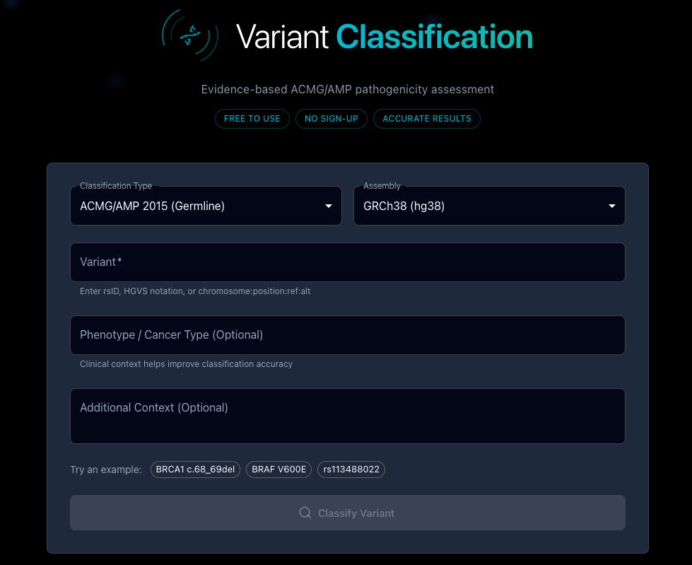

# Variant Classifier

The AIVA Variant Classifier is a public, no-login-required tool for classifying genomic variants according to the ACMG/AMP (American College of Medical Genetics and Genomics / Association for Molecular Pathology) guidelines. It provides an interactive interface for selecting evidence criteria and calculating variant classifications.

---

## Key Features

- **Public access**: No account or login required. Available to anyone.
- **ACMG/AMP compliant**: Implements the 2015 ACMG/AMP standards and guidelines for variant interpretation.
- **Interactive criteria selection**: Select applicable evidence criteria from a comprehensive list.
- **Automatic classification**: Classification is calculated automatically as criteria are selected.
- **Educational tool**: Learn how ACMG criteria combine to produce classifications.

---

## How It Works

1. Select the **Classification Type** (ACMG/AMP 2015 Germline or Somatic) and **Assembly** (GRCh38 or GRCh37).
2. Enter a variant using rsID, HGVS notation, or chromosome:position:ref:alt format.
3. Optionally provide clinical context such as phenotype, cancer type, or additional details to improve classification accuracy.
4. Click **Classify Variant** to run the analysis.
5. Review and select applicable ACMG/AMP evidence criteria.
3. The classifier calculates the five-tier classification based on the selected criteria.
4. Review the classification and the evidence summary.

---

## Public vs. In-App Classification

| Feature | Public Classifier | In-App ACMG Classification |
|---------|-------------------|---------------------------|
| **Login required** | No | Yes |
| **Sample data access** | No (manual entry only) | Yes (auto-populated from sample) |
| **Save classifications** | No | Yes (saved to variant) |
| **Integration with flags/comments** | No | Yes |
| **Report linking** | No | Yes |

For in-app ACMG classification with full integration, see [ACMG Classification](../analysis/acmg-classification.md).

!!! info "Educational use"
    The public Variant Classifier is an excellent tool for training and education. Use it to practice applying ACMG criteria to example variants, or to demonstrate the classification framework to students and colleagues.
