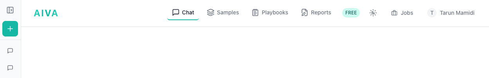
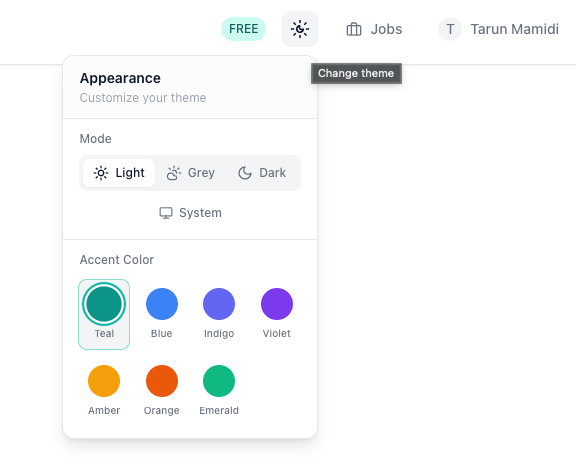

# Navigating the UI

AIVA is organized around a persistent header with navigation tabs, an optional sidebar for chat history, and a central content area that changes based on the active section.

## Main Layout

The interface is divided into three regions:

### Header

The header bar runs across the top of every page and contains:

- **Navigation Tabs**: The primary way to move between sections (see below).
- **Subscription**: Access your subscription plan and upgrade options.
- **Theme Toggle**: Switch between light and dark mode using the palette button in the header.
- **Job Manager**: Opens a panel showing the status of all active and recent background jobs (uploads, annotations, parsing).
- **User Menu**: Access API documentation, settings, help, announcements, and sign-out. See [Account Setup](account-setup.md#user-menu-options) for the full list.

### Sidebar (Chat Mode)

When you are on the Chat page, a collapsible sidebar appears on the left side of the screen:

- **Expanded view**: Shows your full conversation history with titles, timestamps, and a search/filter capability. Click any conversation to reload it. Use the **New Conversation** button at the top to start fresh.
- **Collapsed view**: Displays a narrow icon strip with quick-access buttons for your recent conversations and a button to expand the full sidebar.

The sidebar is only visible on Chat pages. On other pages (Samples, Reports, Playbooks), the full width is given to the content area.

### Content Area

The main region below the header. Its contents change depending on the active navigation tab. For Chat, it fills the available space without scrolling (the chat manages its own scroll). For content-heavy pages like API documentation and Reports, the area becomes scrollable.

## Navigation Tabs

The primary navigation tabs appear in the header. The following tabs are available to all users:

| Tab | Description |
|-----|-------------|
| **Chat** | The AIVA assistant interface. Start conversations, ask questions about your data, run analyses. This is the default landing page after login. |
| **Samples** | Manage projects, upload files, browse and organize your samples. |
| **Playbooks** | Browse, create, and share reusable analysis workflows (Skills marketplace). |
| **Reports** | Create and manage clinical reports with AI-assisted auto-fill. |

Additional sub-pages accessible from within pages:

- **Analysis**: Reached by clicking "Analyze" on a sample. Opens the tertiary analysis workspace with category-based views.
- **API**: Accessed from the user menu in the top-right corner. Contains API documentation, key management, and MCP setup instructions.

!!! info "Active tab indicator"
    The currently active tab is highlighted with an accent-colored underline. If the AIVA agent is running in the background while you are on another tab, the Chat tab shows a subtle glow effect so you know a response is being generated.

## Theme Switching

AIVA supports multiple color schemes and accent colors.

- Click the **palette button** in the header to open the Appearance panel.
- **Mode**: Choose between Light, Grey, Dark, or System (follows your OS preference).
- **Accent Color**: Pick from Teal, Blue, Indigo, Violet, Amber, Orange, or Emerald to personalize the interface.
- Your theme and accent color choices persist across sessions.

## Next Steps

With the layout understood, upload your first genomic file:

[:octicons-arrow-right-24: Uploading Your First Sample](uploading-your-first-sample.md)
