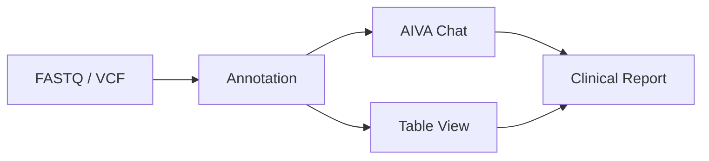

# Platform overview

AIVA covers the full journey from raw sequencing data to a signed clinical report. This page walks through each stage so you know what the platform does and where to find it.

---

<!-- STEP 1 – UPLOAD -->

  

    

      

        
        
        
        Pipeline
      

      

        

          <svg class="aiva-flow__svg" viewBox="0 0 340 280" fill="none" xmlns="http://www.w3.org/2000/svg">
            <g stroke="rgba(0,188,212,.35)" stroke-width="1.5" fill="none">
              <line x1="100" y1="36" x2="100" y2="68"/>
              <line x1="100" y1="98" x2="100" y2="128"/>
              <line x1="80" y1="158" x2="80" y2="196"/>
              <path d="M120,158 L120,168 L235,168 L235,196"/>
              <line x1="260" y1="36" x2="260" y2="168"/>
              <line x1="260" y1="168" x2="235" y2="168"/>
            </g>
            <g fill="rgba(0,188,212,.4)">
              <polygon points="96,64 100,72 104,64"/>
              <polygon points="96,124 100,132 104,124"/>
              <polygon points="76,190 80,198 84,190"/>
              <polygon points="231,190 235,198 239,190"/>
            </g>
            <g>
              <rect x="35" y="6" width="130" height="30" rx="6" fill="rgba(0,188,212,.08)" stroke="rgba(0,188,212,.3)"/>
              <text x="100" y="26" text-anchor="middle" fill="currentColor" font-size="12" font-weight="600">FASTQ</text>
              <rect x="25" y="68" width="150" height="30" rx="6" fill="rgba(0,188,212,.08)" stroke="rgba(0,188,212,.3)"/>
              <text x="100" y="88" text-anchor="middle" fill="currentColor" font-size="12" font-weight="600">Variant Calling</text>
              <rect x="35" y="128" width="130" height="30" rx="6" fill="rgba(0,188,212,.08)" stroke="rgba(0,188,212,.3)"/>
              <text x="100" y="148" text-anchor="middle" fill="currentColor" font-size="12" font-weight="600">BAM</text>
              <rect x="20" y="196" width="120" height="30" rx="6" fill="rgba(0,150,136,.12)" stroke="rgba(0,150,136,.4)"/>
              <text x="80" y="216" text-anchor="middle" fill="currentColor" font-size="12" font-weight="600">PGx</text>
              <rect x="170" y="196" width="130" height="30" rx="6" fill="rgba(0,150,136,.12)" stroke="rgba(0,150,136,.4)"/>
              <text x="235" y="216" text-anchor="middle" fill="currentColor" font-size="12" font-weight="600">Annotation</text>
              <rect x="200" y="6" width="120" height="30" rx="6" fill="rgba(0,188,212,.08)" stroke="rgba(0,188,212,.3)"/>
              <text x="260" y="26" text-anchor="middle" fill="currentColor" font-size="12" font-weight="600">VCF</text>
            </g>
            <text x="80" y="270" text-anchor="middle" fill="currentColor" font-size="9" opacity=".4" font-weight="500" letter-spacing="1">GPU PIPELINE</text>
            <text x="260" y="270" text-anchor="middle" fill="currentColor" font-size="9" opacity=".4" font-weight="500" letter-spacing="1">DIRECT UPLOAD</text>
          </svg>
        

      

    

  

  

    Step 1
    <h2 class="aiva-feature__title">Upload your data</h2>
    
Everything starts with a file. Upload FASTQ files and let GPU-accelerated Parabricks pipelines call variants, generate BAMs, and assign PGx star alleles. Or skip the pipeline: drop a VCF and AIVA annotates it directly.

    <ul class="aiva-feature__bullets">
      <li>Small variant calling powered by NVIDIA Parabricks on GPUs</li>
      <li>BAM file generation with direct IGV links for visual review</li>
      <li>Pharmacogenomic variant calling and star-allele assignment</li>
      <li>Automated annotation with ClinVar, gnomAD, and DITTO scoring</li>
    </ul>
    <a href="../samples/" class="aiva-feature__link">Samples & Uploads →</a>
  

<!-- STEP 2 – AIVA CHAT (reversed) -->

  

    

      

        
        
        
        AIVA Chat
      

      

        
List P/LP variants in @sample:patient007

        

          AIVA
          Found 12 pathogenic variants. Showing top results by classification…
        

        <table class="aiva-chat__table">
          <thead>
            <tr><th>Gene</th><th>Variant</th><th>Class</th></tr>
          </thead>
          <tbody>
            <tr><td>BRCA1</td><td>c.5266dupC (p.Gln1756fs)</td><td>Pathogenic</td></tr>
            <tr><td>TP53</td><td>c.718C>T (p.Gln240*)</td><td>Pathogenic</td></tr>
            <tr><td>MLH1</td><td>c.1972dupC (p.Gln658fs)</td><td>Likely Path.</td></tr>
          </tbody>
        </table>
      

    

  

  

    Step 2
    <h2 class="aiva-feature__title">Ask AIVA Chat</h2>
    
Once your data is loaded, AIVA Chat acts as your AI Clinical Analyst. Ask a question in plain English and get classified, evidence-backed answers grounded in your sample data.

    <ul class="aiva-feature__bullets">
      <li>Review and classify variants with a single prompt</li>
      <li>Automated literature review with cited evidence</li>
      <li>HPO-driven gene prioritization</li>
      <li>Knowledge graph associations between genes, diseases, and drugs</li>
    </ul>
    <a href="../aiva-chat/" class="aiva-feature__link">AIVA Chat →</a>
  

<!-- STEP 3 – TABLE VIEW -->

  

    

      

        
        
        
        Variant Table
      

      

        

          GeneHGVSDITTOClass
        

        

          BRCA2c.5946delT0.97
          Path
        

        

          PTENc.388C>T0.91
          LP
        

        

          APCc.3920T>A0.54
          VUS
        

        

          RB1c.2117G>A0.42
          VUS
        

        
whole genome scale · real-time filtering

      

    

  

  

    Step 3
    <h2 class="aiva-feature__title">Analyze variants manually</h2>
    
Whole genome sequencing produces millions of variants per sample. The table view lets you filter by gene, consequence, frequency, or ACMG class and see results in real time.

    <ul class="aiva-feature__bullets">
      <li>Virtualized rendering with zero performance degradation at whole-genome scale</li>
      <li>One-click export of filtered views to CSV, TSV, or direct to report</li>
      <li>Per-variant flagging, comments, and threaded review for clinical sign-off</li>
    </ul>
    <a href="../analysis/" class="aiva-feature__link">Table View →</a>
  

<!-- STEP 4 – REPORTS (reversed) -->

  

    

      

        
        
        
        Clinical Report
      

      

        

          

          

            

            

          

        

        

          
Interpretation

          

          

          

        

        

          
Findings

          

            Pathogenic
            

          

          

            VUS
            

          

        

      

    

  

  

    Step 4
    <h2 class="aiva-feature__title">Generate a clinical report</h2>
    
Pull your findings into a clinical report. AI-assisted auto-fill populates report sections from your variant data and analysis findings.

    <ul class="aiva-feature__bullets">
      <li>AI Auto-Fill drafts interpretations automatically</li>
      <li>Edit and refine auto-generated content</li>
      <li>Upload custom report templates per assay type</li>
      <li>Sign and export reports</li>
    </ul>
    <a href="../reports/" class="aiva-feature__link">Reports →</a>
  

---

## Putting it all together

Every module connects. Upload a file, analyze it with chat or the table view (or both), and produce a report. No manual data handoff between tools.

For automating workflows, see [Playbooks](../playbooks/index.md).
