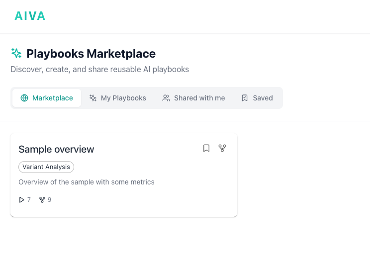

# Playbooks

Playbooks are reusable, step-by-step instructions that guide the AIVA AI assistant through standardized analysis workflows. Instead of typing the same sequence of prompts for every sample, you can create or select a playbook that automates the process, ensuring consistency and saving time.

**Key features:**

- **Marketplace**: browse community-contributed playbooks for common analysis scenarios
- **Custom creation**: write your own playbooks with step-by-step instructions
- **Forking**: copy and modify existing playbooks to suit your needs
- **Sharing**: publish playbooks publicly or share within your team

---

## Playbooks tabs

The Playbooks section is organized into four tabs:

| Tab | Description |
|-----|-------------|
| **Marketplace** | Browse community-contributed playbooks across categories. |
| **My Playbooks** | Playbooks you have created or forked. |
| **Shared with me** | Playbooks shared directly with you by other users. |
| **Saved** | Playbooks you have bookmarked for quick access. |

---

## Using a playbook

1. Navigate to the **Playbooks** section from the main navigation.
2. Browse the marketplace by category (Clinical Variant Interpretation, Rare Disease, Pharmacogenomics, Cancer Genomics, Research, Quality Control) or search by keyword.
3. Click a playbook to preview its steps, tools used, and author details.
4. Click **Fork** if you want to save/modify the playbook before using it.
5. Go to the **Chat** section and select the sample and playbook you want to analyze. Just type `@samples:sample1 @playbook:rare_disease_analysis` and hit enter.

!!! note "Customizing on the fly"
    You can intervene at any point during playbook execution. Add follow-up questions, skip steps, or ask AIVA to go deeper on a particular finding.

---

## Creating a playbook

1. Navigate to **Playbooks** and click **New Playbook**.
2. Enter a **title** and **description**.
3. Add steps, each with a title and instruction written as you would a prompt in AIVA Chat.
4. Optionally specify an expected tool and output format (table, list, summary) for each step.
5. Save for yourself or publish it to the marketplace.

!!! tip "Writing effective steps"
    Be specific ("List all missense variants with CADD > 20 and gnomAD AF < 0.001") rather than vague ("Find important variants"). Reference previous steps to chain analyses, and keep each step focused on one task.

---

## Forking a playbook

If a marketplace playbook is close to what you need but requires modifications:

1. Click **Fork** on the playbook detail page.
2. A copy is created in your personal library.
3. Edit the steps as needed and save.

The fork retains a link to the original. You can **Unpublish** a marketplace playbook at any time. Existing forks by other users are not affected.
