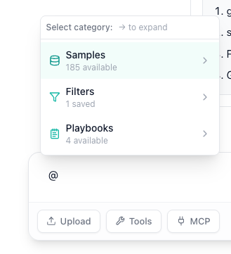

# Quick Start

AIVA lets you analyze genomic data through conversation. Upload a VCF, CSV, or TSV file, then ask questions in plain English. AIVA queries your data, searches the literature, annotates variants, and generates visualizations, all from the chat interface.

---

## Step 1: Upload a sample

From the **Samples** tab, click **Upload** and select your file. For VCF files, you can optionally enable variant annotation during upload. Once submitted, AIVA processes the file in the background.

!!! tip "Already have data uploaded?"
    Skip ahead to Step 2. If you need detailed upload instructions, see [VCF Upload](samples/vcf-upload.md).

## Step 2: Open AIVA Chat

Click the **Chat** tab in the header navigation bar. Start a new conversation by clicking **New Conversation** in the sidebar or typing directly into the message input.

## Step 3: Attach your sample

Type `@:` and then select your sample from the popup menu. This tells AIVA which dataset to query when you ask anything about "your sample."

## Step 4: Ask your first question

Type a question and press ++enter++. AIVA automatically selects the right tools based on what you ask. Try these to get started:

=== "Query your data"

    > "How many pathogenic variants are in BRCA1?"

    AIVA queries your uploaded variant data directly and returns structured results.

=== "Visualize"

    > "Plot the variant count by chromosome as a bar chart."

    AIVA runs Python code to generate charts and statistical summaries from your data.

=== "Search literature"

    > "What does recent research say about TP53 loss-of-function mutations in breast cancer?"

    AIVA searches biomedical databases and the web for relevant publications and findings.

=== "Annotate a variant"

    > "Look up the ClinVar classification and gnomAD frequency for chr17:43094464 G>A."

    AIVA performs real-time lookups against literature, our internal knowledge graph, and public databases.

You do not need to tell AIVA which tool to use. It selects the right tool (or combination of tools) automatically based on your question.

## Step 5: Go deeper

Once you are comfortable with the basics, explore these capabilities:

- **[Knowledge Graph](aiva-chat/ai-tools.md#knowledge-graph)**: Explore gene-protein-drug interaction networks.
- **[Clinical Trials](aiva-chat/ai-tools.md#clinical-trials)**: Search ClinicalTrials.gov for relevant trials by gene, disease, or drug.
- **[Phenotype-Gene Prioritization](aiva-chat/ai-tools.md#phenotype-gene-prioritization)**: Map clinical phenotypes to candidate genes.
- **[Code Interpreter](aiva-chat/ai-tools.md#code-interpreter)**: Run custom Python analysis with pandas, scipy, and matplotlib.
- **[Playbooks](playbooks/index.md)**: Save and share multi-step analysis workflows.

---

## What's next

### Samples

Upload, annotate, and manage your genomic data files.

[:octicons-arrow-right-24: Samples](samples/index.md)

### AIVA Chat

Full documentation for all AI tools, query patterns, and example workflows.

[:octicons-arrow-right-24: AIVA Chat](aiva-chat/index.md)

### Table View

Browse, filter, and export your variant data interactively.

[:octicons-arrow-right-24: Table View](analysis/index.md)

### Analysis

Run tertiary analysis, pharmacogenomics, and ACMG classification.

[:octicons-arrow-right-24: Analysis](analysis/index.md)

### Reports

Generate clinical reports with AI-assisted content and customizable templates.

[:octicons-arrow-right-24: Reports](reports/index.md)

