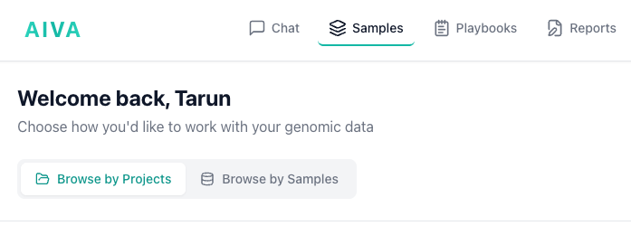
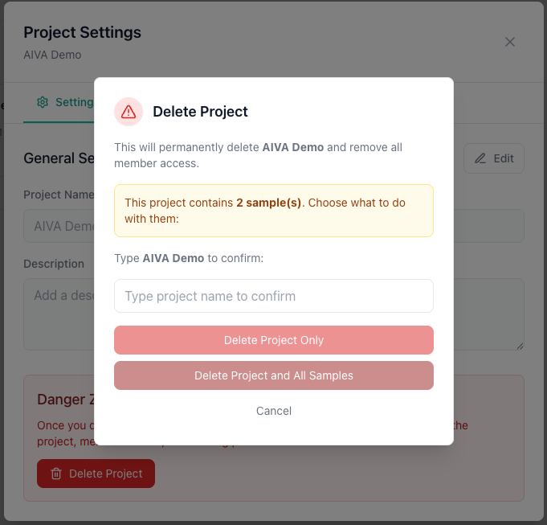

# Managing Samples

Once your files have been uploaded and processed, they appear in your sample list. This page covers how to view, organize, and manage your samples.

---

## Browsing your data

Navigate to the **Samples** tab. The Samples page offers two ways to browse your data:

### Browse by Projects

View your data organized by [project](../collaboration/projects.md). Each project groups related samples together, making it easy to find all samples for a specific study, patient cohort, or collaboration. Click a project to see its samples.

### Browse by Samples

View all your samples as cards across all projects. Each card displays:

- **Sample name**: The file name or a custom name you assigned.
- **Row count**: The number of data rows (variants or records) in the sample.
- **Project**: The project the sample belongs to.
- **Owner**: The user who owns the sample.
- **Status**: Processing status (e.g., Ready, Processing, Error).

Click on any sample to open it in the [Table View](../data-table/index.md) for exploration and analysis.

---

## Sample Metadata

Each sample has associated metadata that you can view:

- **Sample name**: The sample name used during upload.
- **Total variants/rows**: The number of records loaded into the database.
- **Created timestamp**: The date and time the sample was created.
- **Assembly**: Whether the sample is GRCh38 or GRCh37.
- **Sample type**: The type of sample (e.g., WES, WGS).
- **Status**: The current status of the sample (e.g., Ready, Processing, Error).
- **Project assignment**: Which [project](../collaboration/projects.md) the sample belongs to, if any.
- **Clinical notes**: Any clinical notes associated with the sample in plain text.
- **Phenotype terms**: Any phenotype terms associated with the sample.

---

## Deleting Samples

To delete a sample:

1. Navigate to the **Samples** tab.
2. Locate the sample you want to delete.
3. Click the **Delete** action (trash icon or delete button) for that sample.
4. Confirm the deletion in the dialog that appears.

!!! warning "Deletion is permanent"
    Deleting a sample removes the sample record and all associated variant data from the database. This action cannot be undone. Any [flags](../collaboration/variant-flagging.md), [comments](../collaboration/threaded-comments.md), or [ACMG classifications](../analysis/acmg-classification.md) associated with variants in the sample will also be removed.

---

## Assigning Samples to Projects

Samples can be organized into [projects](../collaboration/projects.md) for collaboration and grouping:

1. Navigate to the **Browse by Projects** tab in the **Samples** page.
2. Click on **+New Project** button on top right to create a new project, or select an existing project.
3. Click on **Add Sample** button on the top right to add/upload a sample to the project.
4. Refresh the page and confirm the assignment.

Once assigned, the sample is visible to all collaborators on that project according to their [roles](../collaboration/sharing-and-roles.md).

!!! info "Samples in multiple projects"
    A sample can belong to multiple projects. Only users with access to a project can see the samples assigned to it. This lets you share the same sample with different teams by adding it to each team's project.

---

## Managing projects

Projects are used to organize and collaborate on samples. You can create projects to group related samples and share them with collaborators.

### Adding members

1. Open a project and click the **Settings** icon in the top right.
2. Enter the email address of the person you want to add. The email must belong to an existing AIVA account.
3. Confirm to add them as a project member.

Once added, members can see all samples assigned to the project according to their [role](../collaboration/sharing-and-roles.md).

### Deleting a project

1. Open the project and click the **Settings** icon in the top right.
2. Select **Delete Project**.
3. Type the project name to confirm.
4. Choose **Delete Project Only** to keep the samples, or **Delete Project and All Samples** to remove everything.

!!! warning "Deletion is permanent"
    Deleted projects and their associated data cannot be recovered. If you choose to delete samples along with the project, all variant data, flags, comments, and classifications for those samples are permanently removed.

---

## Tips

- **Name your samples meaningfully**: Use patient IDs, experiment names, or descriptive labels so you can quickly find samples later.
- **Clean up old samples**: Delete samples you no longer need to keep your workspace organized and within your [subscription tier's](../getting-started/subscription-tiers.md) storage limit.
