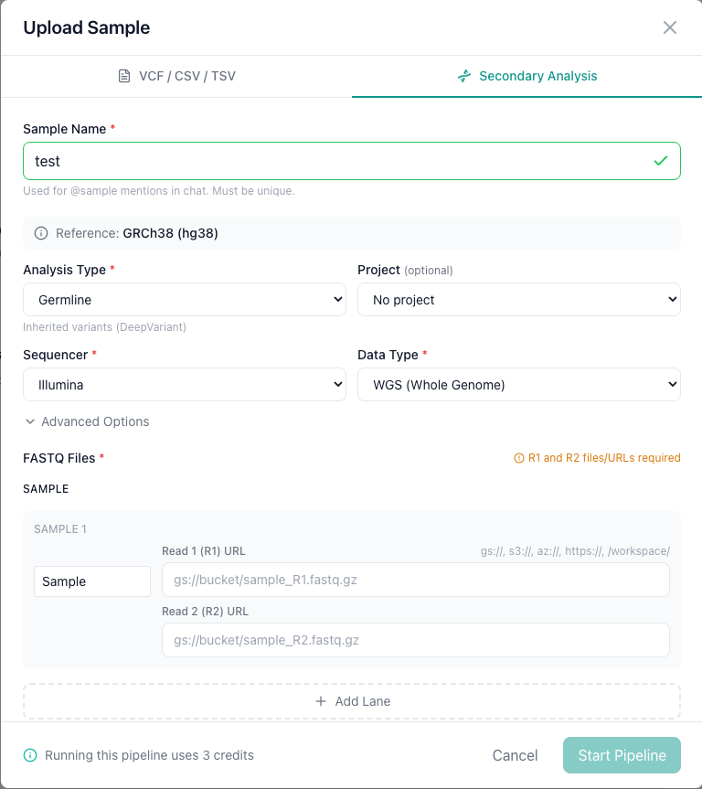
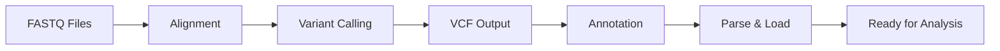
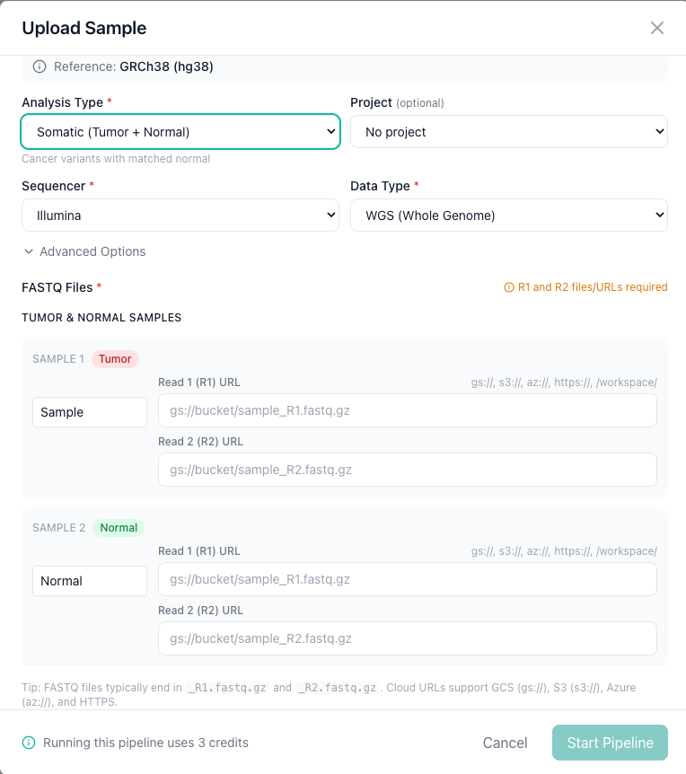

# Secondary Analysis

Secondary analysis takes raw sequencing reads (FASTQ files) and runs a GPU-accelerated small variant calling pipeline powered by NVIDIA Parabricks. The pipeline calls SNVs and indels, which are automatically loaded into AIVA for analysis, along with BAM files for visual review in IGV.

!!! info "Subscription required"
    Secondary analysis is available on Pro and Enterprise tiers. Each pipeline run consumes 3 credits.

---

## What the pipeline produces

| Output | Description |
|--------|-------------|
| **Small variants (VCF)** | SNVs and indels, automatically loaded into AIVA for analysis |
| **BAM** | Aligned reads for visual review via IGV links |
| **PGx star alleles** | Pharmacogenomic star-allele assignments for key pharmacogenes |

!!! note "VCF download not available"
    Called variants are loaded directly into AIVA for analysis. VCF file download is not currently supported.

---

## Starting a pipeline run

Navigate to the **Samples** tab, click **Upload**, and select the **Secondary Analysis** tab.

### Step 1: Name your sample

Enter a **Sample Name**. This is the name that will appear in your sample list and is used for `@sample:` mentions in AIVA Chat.

### Step 2: Configure the pipeline

| Setting | Options | Description |
|---------|---------|-------------|
| **Analysis Type** | Germline, Somatic Paired, Somatic Tumor-Only | Germline for inherited variant analysis. Somatic for cancer workflows (paired tumor-normal or tumor-only). |
| **Sequencer** | Illumina, PacBio, ONT, Ultima, MGI, Element | Both short-read and long-read sequencing platforms are supported. |
| **Data Type** | WGS (Whole Genome), WES (Whole Exome) | Determines pipeline parameters. WES runs may require an interval file. |
| **Reference** | GRCh38 (hg38) | The reference genome build for alignment. |

Optionally assign the sample to a **Project** for team collaboration.

### Step 3: Provide FASTQ files

Enter the cloud storage URLs for your Read 1 (R1) and Read 2 (R2) FASTQ files. Supported URL schemes:

| Scheme | Provider |
|--------|----------|
| `gs://` | Google Cloud Storage |
| `s3://` | Amazon S3 |
| `az://` | Azure Blob Storage |
| `https://` | Any publicly accessible URL |

For paired-end sequencing, both R1 and R2 URLs are required. Click **+ Add Lane** if your sample was sequenced across multiple flow cell lanes.

!!! warning "Files must be publicly accessible"
    AIVA downloads the FASTQ files from the URLs you provide. The files must be publicly readable so that AIVA's server can access them. Private or authenticated URLs will fail with a download error in the Job Manager.

### Step 4: Optional Interval File

- **Interval File**: Upload a BED file to restrict analysis to targeted regions (recommended for WES data).

### Step 5: Start the pipeline

Click **Start Pipeline** to submit. The pipeline run is queued and processed in the background.

---

## Pipeline workflow

1. **Download**: FASTQ files are downloaded from the provided cloud URLs.
2. **Alignment**: Reads are aligned to the reference genome using GPU-accelerated tools.
3. **Variant calling**: Small variants (SNVs and indels) are called using the appropriate caller for your analysis type (DeepVariant for germline, DeepSomatic for tumor workflows).
4. **BAM generation**: Aligned reads are saved as BAM files with IGV links for visual review.
5. **PGx analysis**: Pharmacogenomic star alleles are assigned for key genes.
6. **Annotation**: Small Variant Annotation enriches the output VCF.
7. **Parse and load**: The VCF is parsed and loaded into the AIVA database.

You can monitor each stage in real time using the [Job Manager](job-monitoring.md).

---

## Somatic analysis

### Somatic paired (tumor-normal)

Select **Somatic Paired** as the analysis type for matched tumor-normal samples. You will need to provide FASTQ files for both the tumor and normal samples, each labeled with the appropriate role.

### Somatic tumor-only

Select **Somatic Tumor-Only** when a matched normal sample is not available. Only tumor FASTQ files are required.

---

## Supported FASTQ formats

- Standard FASTQ format (`.fastq`, `.fastq.gz`, `.fq.gz`)
- Gzip-compressed files are recommended to reduce download time
- Both single-end and paired-end reads are supported

---

## Troubleshooting

??? question "My pipeline run failed. What should I do?"
    Open the [Job Manager](job-monitoring.md) and check the error message on the failed job. Common causes include:

    - **Inaccessible FASTQ URLs**: Verify the URLs are valid and the files are accessible from the AIVA server.
    - **Corrupted FASTQ files**: Ensure the files are valid FASTQ format and not truncated.
    - **Mismatched R1/R2 files**: For paired-end data, the R1 and R2 files must contain the same number of reads in the same order.

??? question "How long does a pipeline run take?"
    Processing time depends on file size and data type. A typical 30x whole-genome sample takes approximately 2 hours with GPU acceleration. Whole-exome samples are faster due to the smaller target region.

??? question "Can I run multiple pipeline jobs at once?"
    Jobs are queued and processed based on available GPU resources. You can submit multiple jobs, and they will be processed in order.

---

## Next steps

- [:octicons-arrow-right-24: Monitor your pipeline job](job-monitoring.md)
- [:octicons-arrow-right-24: Review pharmacogenomic results](../analysis/pharmacogenomics.md)
- [:octicons-arrow-right-24: Explore your data in AIVA Chat](../aiva-chat/index.md)
- [:octicons-arrow-right-24: Upload a VCF file directly](vcf-upload.md)
