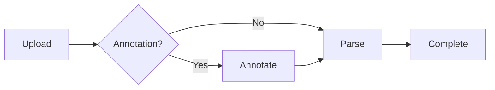

# Uploading Files

AIVA supports local file uploads for VCF, CSV, and TSV formats. This page covers everything you need to know about preparing files, configuring upload options, and understanding what happens after you submit.

!!! info "Looking for cloud imports?"
    If your files are stored in Google Cloud Storage, Amazon S3, Azure, or accessible via HTTPS, see [Cloud URL Imports](cloud-urls.md) instead.

---

## Supported File Formats

| Format | Extensions | Description |
|--------|-----------|-------------|
| **VCF** | `.vcf`, `.vcf.gz` | Variant Call Format, the standard for variant data from sequencing pipelines. Both uncompressed and gzip-compressed files are supported. |
| **CSV** | `.csv` | Comma-separated values. The first row must contain column headers. |
| **TSV** | `.tsv`, `.txt` | Tab-separated values. The first row must contain column headers. |

!!! warning "Column headers required"
    CSV and TSV files **must** include a header row as the first line. AIVA uses these headers as column names in the data table. Files without headers will produce incorrect results.

---

## Step-by-Step Upload

### Step 1: Open the Upload Interface

Navigate to the **Samples** tab in the header navigation bar. Click the **Upload** button to open the upload dialog.

### Step 2: Select Your File

You can add your file in two ways:

=== "Drag and Drop"

    Drag your file from your operating system file manager and drop it onto the upload zone. The zone visually highlights when a compatible file is detected over it.

=== "File Browser"

    Click the upload zone or the **Browse** button to open your system file picker. Navigate to and select your file.

### Step 3: Configure Upload Options

After selecting a file, a configuration panel appears with the following options.

#### Sample Name

Provide an optional human-readable name for the sample. If left blank, the original filename is used. A descriptive name (e.g., "Patient_042_WES" or "BRCA_panel_run_7") makes it easier to identify samples later.

#### Project Assignment

Optionally assign the sample to an existing [project](../collaboration/projects.md). This is useful for organizing related samples and enabling team collaboration. You can also assign samples to projects after upload.

#### Annotation Options (VCF Only)

For VCF files, two optional annotation checkboxes appear:

- **Variant Effect Prediction** -- Runs variant effect predictions to add consequence predictions, gene symbols, transcript information, and clinical significance. Available on Trial, Plus, and Pro tiers.

- **Structural Variant Annotation** -- Annotates structural variants (CNVs, inversions, translocations) with clinical and functional context. Available on Trial, Plus, and Pro tiers.

!!! note "Annotation adds processing time"
    Annotation enriches your data with clinically relevant information but increases processing time. For a whole-exome VCF with ~50,000 variants, Variant Effect Prediction typically adds a few minutes. Whole-genome files with millions of variants may take longer. You can always upload without annotation and examine the raw data first.

For detailed information about each annotation type, see [Variant Effect Prediction](vep-annotation.md) and [Structural Variant Annotation](annotsv-annotation.md).

### Step 4: Submit

Click the **Upload** button to begin. The file is transferred to the server and a background job is created to process it.

---

## What Happens After Submission

Once you submit an upload, AIVA handles everything in the background through a series of processing stages:

### Processing Pipeline

1. **File Transfer** -- Your file is uploaded to the AIVA server and stored securely.

2. **Annotation** (if selected) -- Variant Effect Prediction and/or Structural Variant Annotation processes your variants. New columns are appended to the data with annotation results (consequence, gene symbol, clinical significance scores, etc.).

3. **Parsing** -- The file is parsed and loaded into the database using optimized bulk operations. This approach handles millions of rows efficiently.

4. **Completion** -- The sample appears in your sample list and is ready to open in the data table.

You can monitor each stage in real time using the [Job Manager](job-monitoring.md).

---

## File Size and Upload Limits

Upload limits vary by subscription tier:

| Tier | Upload Count | File Size |
|------|-------------|-----------|
| Free | Limited | Restricted |
| Trial | Unlimited | Unlimited |
| Plus | Increased | Increased |
| Pro | Unlimited | Unlimited |

To check your current usage against your plan limits, click the usage indicator in the header.

For full plan details, see [Subscription Tiers](../getting-started/subscription-tiers.md).

---

## Troubleshooting

??? question "My upload failed immediately. What went wrong?"
    Check the error message in the [Job Manager](job-monitoring.md). Common causes include:

    - **Unsupported file type** -- Only `.vcf`, `.vcf.gz`, `.csv`, `.tsv`, and `.txt` extensions are accepted.
    - **Empty file** -- The file must contain data beyond the header row.
    - **Upload limit reached** -- Your subscription tier may restrict the number of active samples. See [Subscription Tiers](../getting-started/subscription-tiers.md).

??? question "My VCF file was rejected as malformed."
    VCF files must include a valid header section. Verify that your file contains the `#CHROM` header line with the required columns (`CHROM`, `POS`, `ID`, `REF`, `ALT`, `QUAL`, `FILTER`, `INFO`). Files produced by standard variant callers (GATK, DeepVariant, bcftools) are fully compatible.

??? question "My CSV columns are not parsed correctly."
    Ensure your file uses commas as delimiters and that the first row contains headers. If your data uses tabs, rename the file with a `.tsv` extension. If your data uses semicolons or other delimiters, convert it to standard CSV format before uploading.

??? question "Can I upload multiple files at once?"
    Currently, AIVA processes one file upload at a time. You can submit multiple uploads in sequence, and each will be queued and processed independently. Monitor all active jobs in the [Job Manager](job-monitoring.md).

---

## Next Steps

- [:octicons-arrow-right-24: Monitor your upload job](job-monitoring.md)
- [:octicons-arrow-right-24: Import files from cloud storage](cloud-urls.md)
- [:octicons-arrow-right-24: Learn about Variant Effect Prediction](vep-annotation.md)
- [:octicons-arrow-right-24: Manage your samples](managing-samples.md)
