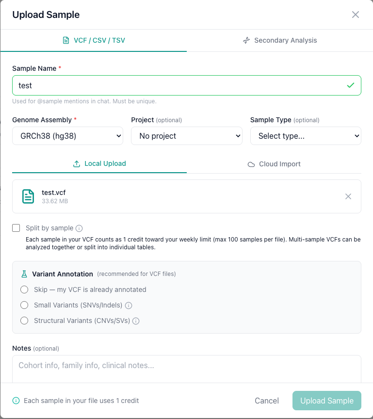
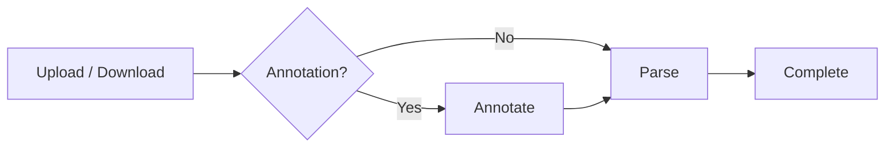

# VCF Upload

Upload VCF, CSV, and TSV files to AIVA for interactive analysis. You can upload from your local machine or import directly from cloud storage.

---

## Supported file formats

| Format | Extensions | Description |
|--------|-----------|-------------|
| **VCF** | `.vcf`, `.vcf.gz` | Variant Call Format, the standard for variant data from sequencing pipelines. Both uncompressed and gzip-compressed files are supported. |
| **CSV** | `.csv` | Comma-separated values. The first row must contain column headers. |
| **TSV** | `.tsv`, `.txt` | Tab-separated values. The first row must contain column headers. |

!!! warning "Column headers required"
    CSV and TSV files **must** include a header row as the first line. AIVA uses these headers as column names in the table view. Files without headers will produce incorrect results.

!!! tip "Have FASTQ files?"
    If you need to run variant calling from raw sequencing reads, see [Secondary Analysis](secondary-analysis.md) instead.

---

## Local upload

### Step 1: Open the upload dialog

Navigate to the **Samples** tab and click the **Upload** button on the top right. The upload dialog opens with two tabs: select the **VCF / CSV / TSV** tab.

### Step 2: Select your file

Drag your file onto the upload zone, or click to browse your file system.

### Step 3: Configure upload options

#### Sample name

Provide a human-readable name for the sample. This name is used for `@sample:` mentions in AIVA Chat. A descriptive name (e.g., "Patient_042_WES" or "BRCA_panel_run_7") makes it easier to identify samples later.

#### Genome assembly

Select the reference genome build your file was aligned to. Currently **GRCh38 (hg38)** is supported for variant annotation.

#### Project assignment

Optionally assign the sample to an existing project for team collaboration. You can also assign samples to projects after upload.

#### Sample type

Optionally tag the sample type for organizational purposes.

#### Split by sample (multi-sample VCF)

For multi-sample VCF files, check **Split by sample** to create a separate table for each sample (max 100 samples per file). Splitting makes it easier to process variants for individual samples (faster query execution) compared to analyzing all samples together in a single large table. Leave unchecked to keep all samples together in a single table.

!!! note "Credit usage"
    Credits are charged per sample in the file regardless of whether you split or not.

#### Annotation options (VCF only)

For VCF files, you can choose how annotation is handled:

- **None (bring your own)**: If your VCF is already annotated from your own pipeline (e.g., VEP, SnpEff, or a custom workflow), click "Skip". AIVA preserves all existing columns and INFO fields exactly as they are in your file.

- **Small Variant Annotation**: Adds consequence predictions, gene/transcript info, allele frequencies, prediction scores, and clinical significance.

- **Structural Variant Annotation**: Annotates structural variants (CNVs, inversions, translocations) with clinical and functional context.

!!! info "Your annotations are never overwritten"
    All columns added by AIVA's annotation are prefixed with `aiva_csq_` (e.g., `aiva_csq_gene_symbol`, `aiva_csq_consequence`). If your VCF already contains annotations, they are preserved and you can use both side by side in the table view and AIVA Chat.

!!! note "Annotation adds processing time"
    Annotation enriches your data with clinically relevant information but increases processing time. For a whole-exome VCF with ~50,000 variants, Small Variant Annotation typically adds a few minutes. Whole-genome files with millions of variants may take longer. You cannot annotate samples from the chat interface.

### Step 4: Submit

Click **Upload Sample** to begin. The file is transferred to the server and a background job is created to process it.

---

## Cloud URL import

Instead of downloading a file to your local machine and re-uploading it, you can paste a cloud storage URL and AIVA handles the download and processing server-side.

### Supported URL schemes

| Scheme | Service | Example |
|--------|---------|---------|
| `gs://` | Google Cloud Storage | `gs://my-bucket/samples/patient-001.vcf.gz` |
| `s3://` | Amazon S3 | `s3://lab-data/exome/sample-42.vcf` |
| `az://` | Azure Blob Storage | `az://container/path/to/variants.vcf` |
| `https://` | Public HTTPS URL | `https://example.com/data/variants.csv` |

### How to import

1. Navigate to the **Samples** section.
2. Click **Upload** or open the upload dialog.
3. Select the **Cloud URL** import option.
4. Paste the full URL of the file you want to import.
5. (Optional) Enable Small Variant Annotation or Structural Variant Annotation if the file is a VCF.
6. Click **Submit**.

### File accessibility

!!! warning "Files must be publicly accessible"
    AIVA downloads the file from the URL you provide. The file must be publicly readable so that AIVA's server can access it. Private or authenticated URLs will fail with a download error in the Job Manager.

---

## Processing pipeline

Once you submit an upload (local or cloud), AIVA handles everything in the background:

1. **File transfer**: Your file is uploaded to the server or downloaded from the cloud URL.
2. **Annotation** (if selected): Small Variant Annotation and/or Structural Variant Annotation processes your variants. New columns are appended to the data with annotation results.
3. **Parsing**: The file is parsed and loaded into the database using optimized bulk operations.
4. **Completion**: The sample appears in your sample list and is ready to open in the table view.

You can monitor each stage in real time using the [Job Manager](job-monitoring.md).

---

## File size and credit limits

Each file upload consumes **1 credit per sample** in the file. Credits and file size limits vary by tier:

| Tier | Credits per Week | Max File Size |
|------|:----------------:|:-------------:|
| Free | 0 (no uploads) | 250 MB |
| Trial | 1 | 500 MB |
| Plus | 3 | 750 MB |
| Pro | 10 | 1 GB |
| Enterprise | Unlimited | Unlimited |

Credits are checked before the job starts and consumed when the job completes. Credits reset every Sunday.

For full plan details and credit costs, see [Subscription Tiers](../getting-started/subscription-tiers.md#credit-system).

---

## Tips

- **Use compressed files when possible**: Uploading `.vcf.gz` files reduces transfer time and storage compared to uncompressed `.vcf` files.
- **Verify cloud URLs before submitting**: Paste the URL in a browser or use `curl` to confirm the file is accessible before submitting to AIVA.
- **Check job status**: If an upload or cloud import seems stuck, check the [Job Manager](job-monitoring.md) for error messages.

---

## Troubleshooting

??? question "My upload failed immediately. What went wrong?"
    Check the error message in the [Job Manager](job-monitoring.md). Common causes include:

    - **Unsupported file type**: Only `.vcf`, `.vcf.gz`, `.csv`, `.tsv`, and `.txt` extensions are accepted.
    - **Empty file**: The file must contain data beyond the header row.
    - **Upload limit reached**: Your subscription tier may restrict the number of active samples. See [Subscription Tiers](../getting-started/subscription-tiers.md).

??? question "My VCF file was rejected as malformed."
    VCF files must include a valid header section. Verify that your file contains the `#CHROM` header line with the required columns (`CHROM`, `POS`, `ID`, `REF`, `ALT`, `QUAL`, `FILTER`, `INFO`). Files produced by standard variant callers (GATK, DeepVariant, bcftools) are fully compatible.

??? question "My CSV columns are not parsed correctly."
    Ensure your file uses commas as delimiters and that the first row contains headers. If your data uses tabs, rename the file with a `.tsv` extension. If your data uses semicolons or other delimiters, convert it to standard CSV format before uploading.

??? question "Can I upload multiple files at once?"
    Currently, AIVA processes one file upload at a time. You can submit multiple uploads in sequence, and each will be queued and processed independently. Monitor all active jobs in the [Job Manager](job-monitoring.md).

??? question "My cloud import failed with a download error."
    The cloud URL may be inaccessible due to expired credentials, incorrect permissions, or network issues. Verify that the URL is valid, the resource exists, and your credentials (if required) are current.

---

## Next steps

- [:octicons-arrow-right-24: Monitor your upload job](job-monitoring.md)
- [:octicons-arrow-right-24: Manage your samples](managing-samples.md)
- [:octicons-arrow-right-24: Run secondary analysis from FASTQ files](secondary-analysis.md)
